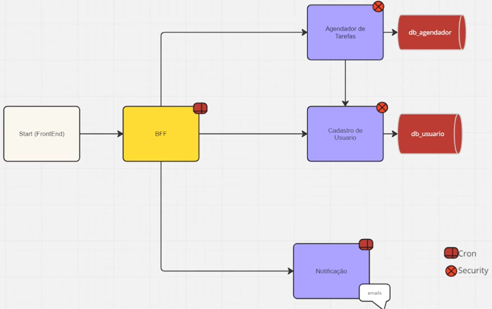

# Documentação do projeto

A imagem abaixo mostra os quatro microsserviços desenvolveidos no projeto:
- microsserviço usuario: responsável pelo CRUD de usuários. Banco de dados utilizado: PostgreSQL
  - acesse o repositório: https://github.com/IsacLopesS/usuario 
- microsserviço agendador-tarefas:  gerencia as tarefas dos usuarios - cria tarefa, atualiza, e exclui. Banco de dados utilizado: MongoDB
  - acesse o repositório: https://github.com/IsacLopesS/agendador-tarefas 
- microsserviço notificação: responsável por notificar o usuário da tarefa por email, com 10 minutos de antecedencia, e tambem na hora agendada. (Requisições via CRON)
  - acesseo repositório: https://github.com/IsacLopesS/notificacao   
- microsserviço bff: por onde o frontend acessa os outros microsserviços. O bff recebe a requisição do frontend e direciona para os outros microsserviços.

